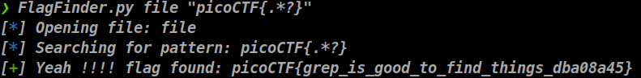

# Intro

This little python script try to automate the pattern searching in files.
This is a common quest in begginers CTF, and when you have already understood how strings search work, it's faster to use this tool.

# Installation

First, install requirements

> pip3 install -r requirements.txt

and that's mostly enough

# Usage

In your terminal, type the following command, adjust **source_file** and **Flag_pattern** to your needs
A copy of the flag is stored in the flag.txt file.

**ATTENTION** in **ZSH** Flag_pattern **MUST** be surrounded by ", or script will crash.

> python3 FlagFinder.py source_file Flag_pattern

# Work with

- Text grep in file
- Strings search in file
- Meta search in file

# Know bugs

- ~~When the script don't find the pattern, it doesn't return the error message, but instead it's closing itself.~~
- ~~Answer is surrounded by extra [''], a bit annoying compare to the end result that I had desired~~
