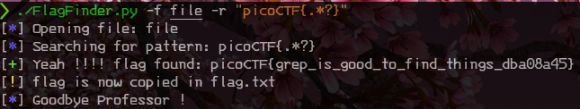

# Intro

This little python try to automate the pattern searching in files.
This is a common quest in begginers CTF, and when you have already understood how strings search work, it's faster to use this tool.

# Usage

>python3 FlagFinder.py source_file Flag_pattern

